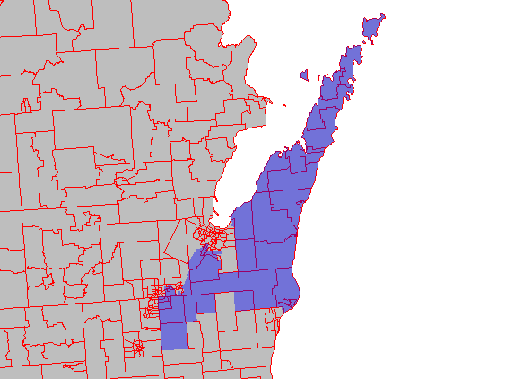

## Introduction
This package uses 2010 census tract level demographic data in conjunction with federal, state upper house, and state lower house legislative voting boundaries to better understand the demographic makeup of each of these political areas. It creates three `SpatialPolygonDataFrames`, one for each type of legislative body, that contain voting age (18 and Over) data total population, White population, Back population, American Indian population, Asian population, Hawaiian/pacific islander and Hispanic population for each of the districts within that legislative body. This can be done for all 48 contiguous states in the United States. 

The development of this package was originally thought of by Sam Wang & Brian Remlinger at the [Princeton Gerrymandering Project](http://gerrymander.princeton.edu/). Gerrymandering, which involves drawing the boundaries of legislative districts to benefit one party or the other, is a current hot topic in the US with challenges to [Wisconsin's state redistricting in 2012](https://www.reuters.com/article/us-usa-court-election/justice-kennedy-on-hot-seat-in-major-voting-rights-case-idUSKCN1C81P2) being debated in the Supreme Court during the development of this package. This case could have lasting effect on how political voting districts are drawn in the US. However, gerrymandering has occurred in the US for most of its history, but a workable standard for determining if a district is gerrymandered remains elusive.

Understanding how gerrymandering districts affects the distribution of racial groups within legislative district is an important step to understanding the problem. Techniques such as "stacking" or "cracking" can diminish the ability for minority populations to gain representation in legislative boundaries.  In Baldus v. Brennan, a federal judge ruled that the way certain assembly districts had been drawn in Milwaukee had effectively ['cracked' Latino voters](https://www.propublica.org/article/partisan-gerrymandering-is-still-about-race).

### Necessary Project Pre-Work
In oreder for this project wor work on anyones computer the user needs to do two premptive actions before starting.  The first is to determine the Federal Information Processing Standard Publication (FIPS) code for the US state of interest.  FIPS codes can be obtained form the [census](https://www.census.gov/geo/reference/ansi_statetables.html) wesbite. 

The second step will be to obtain a census key from this website: [https://api.census.gov/data/key_signup.html](https://api.census.gov/data/key_signup.html).  This key allows the user to obtain access to the census data provided by the package `tidycensus`, which is a required package for this package.

## Methods

### Data Acquisition and Preparation (Andrea Huerfano)

### Intersections and Population Calculations (Cory Hertog)
The below figure demonstrates the problem with using census tracts to determine the populations of districts.

To determine population for each district type, we assume that population throughout a census tract is dispersed evenly. The package uses functions from the packages from `raster`, `sp` and `rgeos`.  The basic idea behind dispersing population within districts from census tracts is to give the proportion of the population to the district the same as the proportion of area that that district overlaps within that tract. To do this the following procedures were done in the script "Dist_Pop_Create.R":

1. Project `SpatialPolygonDataFrames` of legislative districts and census tracts into an Albers Equal Area US projection system using `spTransform`.

2. use `gArea` to determine the area of each census tract.

3. use `raster::intersect` to determine the which census tracts each district in the respective `SpatialPolygonDataFrame` level of political entity (Federal Congressional, State Upper House, State Lower House).  The reason to use `intersect` here, as opposed to `gIntersection` or `gIntersects` is because this function not only retains `data.frame` information, but it also only retains the portion of a tracts that it actually intersects, not the entire tracts itself.

4. Use `gArea` by id to calculate the area of each tract that each district intersects. Divide each area of the portion of the census tract by the same tract's entire area.  This serves as the ratio to multiple population by to disperse to its respective district.

5. Multiply each of the demographic populations numbers in each census tract by that census tracts intersected area ratio.

6. Sum each census tracts proportioned racial population types in each district, then create a `data.frame` with that district's information attached.

7.  This is wrapped in an `sapply` so it can be done iteratively for each district in  that legislative level. The following code chunk is an example of how this is setup for one legislative level:

```{r eval=FALSE}
# Function for Creating State Lower DataFrames with Population
# Based on area of each census tract the district boundary covers
sld_pop_table <- as.data.frame(t(sapply(1:length(state_lower@data$SLDLST), function(z) {
  sd_c_int <- intersect(x =  state_lower[state_lower@data$SLDLST == z,],
                        y = state_tracts_pop)
  dc_area <- gArea(spgeom = sd_c_int, byid = TRUE)/1000000
  percentage <- dc_area/sd_c_int@data$AREA
  Pop_Total <- round(sum(sd_c_int@data$Pop_Total*percentage))
  Pop_White <- round(sum(sd_c_int@data$Pop_White*percentage))
  Pop_Black <- round(sum(sd_c_int@data$Pop_Black*percentage))
  Pop_American_Indian <- round(sum(sd_c_int@data$Pop_American_Indian*percentage))
  Pop_Asian <- round(sum(sd_c_int@data$Pop_Asian*percentage))
  Pop_Hawaian_Pacific_Islander <- round(sum(sd_c_int@data$Pop_Hawaian_Pacific_Islander*percentage))
  Pop_Hispanic <- round(sum(sd_c_int@data$Pop_Hispanic*percentage))
  unlist(data.frame(state_lower[state_lower@data$SLDLST == z,], Pop_Total, Pop_White, Pop_Black,
                    Pop_American_Indian, Pop_Asian, Pop_Hawaian_Pacific_Islander,
                    Pop_Hispanic))

})))
```
8. Because some of the information in the census tract data frames have letters in them, all information is reduced to being factors.  Therefore an lapply function that is detailed in `?factor` transforms the factor in the table into numeric data. This is beneficial when displaying the data.  The following code is an example of the code that does this

```{r eval = FALSE}
sld_pop_table[] <- lapply(sld_pop_table, function(x)
  as.numeric(levels(x))[x])

```
9. Finally, the function `merge` is used to merge the population data frame with the legislative districts "SpatialPolygonsDataFrame" based on the district numbers which are present in both data frames:
```{r eval = FALSE}
sld_pop <- merge(x = state_lower, y = sld_pop_table, by = "SLDLST")
```

This code/process is essentially run three different times since the three different legislative districts have differing data frame attributes from the data retrieval. The outcome is three `SpatialPolygonDataFrames` for the three different legislative levels.

## Results
The results from this code can create three `SpatialPolygonDataFrames` objects:
- `sld_pop`: State Lower House Distrcts with associated population data
- `sud_pop`: State Upper House Districts with associated population data
- `sfcd_pop`: State Level Federal Congressional Districts with associated populations data

These three spatial data farems can than be used to create choropleth maps of voting age population in the stte in each of the three levels of legislative districts

Population's Information is available for the following Ethnic groups, as classified by the US Census Bureau, and avaialable for each district in each of the the three `SpatialPolygonDataFrames`:

- "Pop_Total": the total voting age population of the district
- "Pop_White": the total voting age population identified as white for the district
- "Pop_Black": the total voting age population identified as black for the district
- "Pop_American_Indian": the total voting age population identified as American Indian for the district
- "Pop_Asian": the total voting age population identified as Asian for the district
- "Pop_Hawaiian_Pacific_Islander": the total voting age populations identified as Hawaiian/Pacific Islander for the district
- "Pop_Hispanic": the total voting age populations identified as Hispanic for the district

In order to display the data and create readable maps, we used the `tamp` and `tmaptools` packages. These follow simialr coding rules as laid out in the tidyverse and the package `ggplot2`.  This package not only made making readable choropleth maps quickly, 

## Discussion
