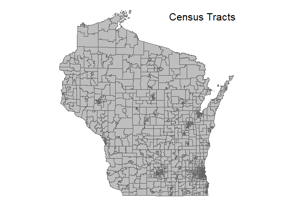

```{r setup, include=FALSE}
knitr::opts_chunk$set(echo = FALSE)
library(knitr)
library(png)
```

# Introduction

## Project Summary (Cory Hertog)
This package uses 2010 census tract level demographic data in conjunction with federal, state upper house, and state lower house legislative voting boundaries to better understand the demographic makeup of each of these political areas. It creates three `SpatialPolygonDataFrames`, one for each type of legislative body, that contain voting age (18 and over) population, White population, Black population, American Indian population, Asian population, Hawaiian/Pacific Islander and Hispanic population for each of the districts within that legislative body. This can be done for all 48 contiguous states in the United States.

## Gerrymandering and Project Background (Cory Hertog)
The development of this package was originally thought of by Sam Wang & Brian Remlinger at the [Princeton Gerrymandering Project](http://gerrymander.princeton.edu/). Gerrymandering, which involves drawing the boundaries of legislative districts to benefit one party or the other, is a current hot topic in the US with challenges to [Wisconsin's state redistricting in 2012](https://www.reuters.com/article/us-usa-court-election/justice-kennedy-on-hot-seat-in-major-voting-rights-case-idUSKCN1C81P2) being debated in the Supreme Court during the development of this package. This case could have lasting effect on how political voting districts are drawn in the US. However, gerrymandering has occurred in the US for most of its history, but a workable standard for determining if a district is gerrymandered remains elusive.

Understanding how gerrymandering districts affects the distribution of racial groups within legislative districts is an important step to understanding the problem. Techniques such as "stacking" or "cracking" can diminish the ability for minority populations to gain representation in legislative boundaries.  In Baldus v. Brennan, a federal judge ruled that the way certain assembly districts had been drawn in Milwaukee had effectively ['cracked' Latino voters](https://www.propublica.org/article/partisan-gerrymandering-is-still-about-race). This package hopes to help develop an understanding for how certain races are disperesed throughout legislative districts.


## Necessary Packages and Descriptions (Andrea Huerfano)

##TIGRIS package: 

Created by Professor Kyle Walker at the Texas Christian University, this package allows the user to to access all of the TIGER/Line shapefiles, of the available geographic areas of the US Census Bureau.  


                     Geographic Areas of the US Census Bureau, by Hierarchy
```{r fig.align='center', out.width= "80%", out.height= "30%"}
include_graphics("fig/Census_pic.png")
```
 *Source: US Census Bureau * 

**Data access:**

When using tigris, the desired geographic data is requested throught the calling of a function.

For this package,the census tracts, congressional districts, and the state legislative districts shapefiles need to be accessed:

```{r echo = TRUE, eval=FALSE}
# State: Winsconsin
WI<-states(WI)
# WI census tracts 
WI_tracts<- tracts(state = 'WI',CB=TRUE)
#WI State lower legislative district 
WI_state_lower<- state_legislative_districts(state = 'WI', house = "lower", cb = TRUE,
    year = NULL)
#WI State Upper House Districts
WI_state_upper <- state_legislative_districts(state = 'WI', house = "upper", cb = TRUE,
year = NULL)

#WI Federal Congressional Districts
WI_fed_congress<- congressional_districts(cb = TRUE, year = NULL)

```
When running a function on Tigris, The result is a SpatialPolygonDataFrame:
                                     
                                    Wisconsin Census Tracts - Top 20
```{r fig.align='center', out.width= "90%", out.height= "60%"}
include_graphics("fig/WI_Census_tracts.png")
```
A benefit of using the Tigris package is the ability to choose between the use of The TIGER/Line shapefiles and the Cartographic Boundary Files. The TIGER/Line shapefiles have more detailed data in interior areas, and coastal areas are represented three miles beyond the shoreline. On the other hand, the Cartographic Boundary Files have less detail in interior areas, and do not include the coastal areas (Tigris: An R Package to Access and Work with Geographic Data from the US Census Bureau).

For this project,we need to calculate the area of the census tracts, without including any area beyond shorelines.In order to have the Cartographic Boundary Files selected, the cb parameter on the function needs to be set to TRUE.
```{r echo = TRUE, eval=FALSE}
(Wstate_tracts_NAD83<-tracts(state = 'WI', cb= TRUE))
```
 *Wisconsin Tracts: TIGER/Line shapefiles & Cartographic Boundary Files *
```{r out.width= "45%", out.height= "80%"}
include_graphics("fig/CB_none.png")
include_graphics("fig/CB_True.png")

```

## Tidycensus package 

Another package created by Prof. Kyle walker at TCU. This package uses the Census Data Application Programming Interface(API). The Census Data API allows users to query data from the Census Bureau in a more efficient manner, while connecting to R and SAS (Census Data API User Guide).Therefore,in order to access census data, it is necessary to obtain a census key from the Census website: [https://api.census.gov/data/key_signup.html](https://api.census.gov/data/key_signup.html).  
Once user has key,the function 'census_api_key(key, install = TRUE)' is used to set key in R. The key value in this function is the key provided to user by the census.

There are two functions within the tidycensus package, that allow users to obtain the tabular data from both decennial US Census and the American Community Survey. These are the get_decennial and get_acs.For this project we use the former.

The load_variables function of Tidycensus helps a user find a desired variable. The function takes two required arguments: the year of the Census or endyear of the ACS sample, and the dataset:"sf1"(decennial short form), "sf3" (decennial long form), or "acs5" (ACS).For this project "sf1" is used.
```{r echo = TRUE, eval=FALSE}
pop_attempt <- load_variables(2010, dataset = "sf1")
```
The result of the load_variables function is a data.frame: 
```{r fig.align='center', out.width= "80%", out.height= "40%"}
include_graphics("fig/load_variables.png")
```
The following variables are needed for this project: 

* Total population: "P0100001"
* White,over 18 years old = "P016A003"
+ Black,over 18 years old ="P016B003"
+ American Indian,over18 = "P036C003"
+ Asian,over18 = "P016D003"
+ Pacific Islander,over18 ="P036E003"
+ Hispanic,over18 ="P016H003"

Once the user has identified the variables to be used, two functions can be used. 
    -get_decennial: to access decennial datasets (1990,2010,2010)
    -get_acs: to access American Comumunity Survey datasets (2010 through 2016).

For this project, Decennial data is used: 

```{r echo = TRUE, eval=FALSE}

  # Function to obtain tabular data:

all<-get_decennial(geography = "tract", variables = "P0100001", state= FIPS, year=2010)
White_over18<-get_decennial(geography = "tract", variables ="P016A003",state = FIPS, year = 2010)
Black_over18<-get_decennial(geography = "tract", variables ="P016B003",state = FIPS, year = 2010)
American_Indian_over18<-get_decennial(geography = "tract", variables ="P036C003",state = FIPS, year = 2010)
Asian_over18<-get_decennial(geography = "tract", variables ="P016D003",state = FIPS, year = 2010)
Pacific_Islander_over18<-get_decennial(geography = "tract", variables ="P036E003",state = FIPS, year = 2010)
Hispanic_over18<-get_decennial(geography = "tract", variables ="P016H003",state = FIPS, year = 2010)
```
The get_decennial function outputs a data.frame:

                    White Population, Over 18 - Wisconsin Census Tracts
```{r fig.align='center', out.width= "60%", out.height= "30%"}
include_graphics("fig/Result_get_decennial.png")
```
## Necessary Project Pre-Work (Cory Hertog)
In order for this project to work on anyone's computer the user needs to do two premptive actions before starting.  The first is to determine the Federal Information Processing Standard Publication (FIPS) code for the US state of interest.  FIPS codes can be obtained form the [census](https://www.census.gov/geo/reference/ansi_statetables.html) wesbite. 

The second step will be to obtain a census key from this website: [https://api.census.gov/data/key_signup.html](https://api.census.gov/data/key_signup.html).  This key allows the user to obtain access to the census data provided by the package `tidycensus`, which is a required package for this package.

# Methods

## Data Acquisition and Preparation (Andrea Huerfano)

In order To continue with the necessary calculations for this project, the data obtained from the Tigris package needs to be prepared. the following procedures will do so:

1.Join all the data.frame outputs from the get_decennial functions. cbind is used For this purpose: 

```{r echo = TRUE, eval=FALSE}
Universe_18<-cbind(all,White_over18$value,Black_over18$value,American_Indian_over18$value,Asian_over18$value,Pacific_Island
```
```{r fig.align='center', out.width= "100%", out.height= "80%"}
include_graphics("fig/Cbind_Demographics.png")
```

2. Change column names, in order to identify variables more easily:

```{r echo = TRUE, eval=FALSE}
names(Universe_18)[4:10]<-c("Entire population","White","Black","American Indian","Asian","Hawaian/Pacific Islander","Hispanic")
```

Finally, the results of the spatial data from the Tigris package need to be merged with the results of tabular data from the Tidycensus package.

```{r echo = TRUE, eval=FALSE}
state_tracts_pop <- merge(state_tracts,Universe_18, by = "GEOID")
```


## Necessary Project Pre-Work (Cory Hertog)
In order for this project to work on anyone's computer the user needs to do two premptive actions before starting.  The first is to determine the Federal Information Processing Standard Publication (FIPS) code for the US state of interest.  FIPS codes can be obtained form the [census](https://www.census.gov/geo/reference/ansi_statetables.html) wesbite. 

The second step 


# Methods

## Data Acquisition and Preparation (Andrea Huerfano)

```{r out.width= "30%", out.height= "30%"}


```
```{r fig.align='center', out.width= "50%", out.height= "50%"}

```

## Intersections and Population Calculations (Cory Hertog)
The largest problem with determining population of legislative districts is that census tract boundaries do no match the boundaries of districts. The below figure demonstrates the problem with using census tracts to determine the populations of districts. The blue area is Wisconsin's Lower House District 1, while the red outlines are the census tract boundaries. The problem areas in this case can mainly be seen in the southern portion of the district boundaries.

```{r fig.align='center', out.width= "60%", out.height= "30%"}
include_graphics("fig/SUD1_wtracts.png")
```

To determine population for each legislative district type, we assume that population throughout a census tract is dispersed evenly. The package uses functions from the packages `raster`, `sp` and `rgeos`.  The basic idea behind distributing population within districts from census tracts is to give the proportion of the population to the district that is equal to the proportion of area that that district overlaps within that tract. To do this the following procedures were done:

1. Project `SpatialPolygonDataFrames` of legislative districts and census tracts into an Albers Equal Area US projection system using `spTransform`.

2. use `gArea` to determine the area of each census tract.

3. use `raster::intersect` to determine the which census tracts each district in the respective `SpatialPolygonDataFrame` level of political entity (Federal Congressional, State Upper House, State Lower House).  The reason to use `intersect` , as opposed to `gIntersection` or `gIntersects`, is because this function not only retains `data.frame` information, but it also only retains the portion of the tract that it actually intersects, not the entire tract itself.

4. Use `gArea` by id to calculate the area of each tract that each district intersects. Divide each area of the portion of the census tract by the same tract's entire area.  This serves as the ratio to multiply population by to disperse to its respective district.

5. Multiply each of the demographic populations numbers in each census tract by that census tract's intersected area ratio.

6. Sum each census tract's proportioned  population types in each district. Then create a `data.frame` with that district's information attached.

7.  This is wrapped in an `sapply` so it can be done iteratively for each district in  that legislative level. The following code chunk is an example of how this is setup for one legislative level:

```{r echo = TRUE, eval=FALSE}
# Function for Creating State Lower DataFrames with Population
# Based on area of each census tract the district boundary covers
sld_pop_table <- as.data.frame(t(sapply(1:length(state_lower@data$SLDLST), function(z) {
  sd_c_int <- intersect(x =  state_lower[state_lower@data$SLDLST == z,],
                        y = state_tracts_pop)
  dc_area <- gArea(spgeom = sd_c_int, byid = TRUE)/1000000
  percentage <- dc_area/sd_c_int@data$AREA
  Pop_Total <- round(sum(sd_c_int@data$Pop_Total*percentage))
  Pop_White <- round(sum(sd_c_int@data$Pop_White*percentage))
  Pop_Black <- round(sum(sd_c_int@data$Pop_Black*percentage))
  Pop_American_Indian <- round(sum(sd_c_int@data$Pop_American_Indian*percentage))
  Pop_Asian <- round(sum(sd_c_int@data$Pop_Asian*percentage))
  Pop_Hawaian_Pacific_Islander <- round(sum(sd_c_int@data$Pop_Hawaian_Pacific_Islander*percentage))
  Pop_Hispanic <- round(sum(sd_c_int@data$Pop_Hispanic*percentage))
  unlist(data.frame(state_lower[state_lower@data$SLDLST == z,], Pop_Total, Pop_White, Pop_Black,
                    Pop_American_Indian, Pop_Asian, Pop_Hawaian_Pacific_Islander,
                    Pop_Hispanic))

})))
```
8. Because some of the information in the census tract data frames have letters in them, all information is reduced to being factors.  Therefore an `lapply` function that is detailed in `?factor` transforms the factor in the table into numeric data. This is beneficial when displaying the data.  The following code is an example of the code that does this

```{r echo = TRUE, eval = FALSE}
sld_pop_table[] <- lapply(sld_pop_table, function(x)
  as.numeric(levels(x))[x])

```
9. Finally, the function `merge` is used to merge the population data frame with the legislative districts `SpatialPolygonsDataFrame` based on the district numbers which are present in both data frames:
```{r echo = TRUE, eval = FALSE}
sld_pop <- merge(x = state_lower, y = sld_pop_table, by = "SLDLST")
```

This code/process is essentially run three different times since the three different legislative districts have differing data frame attributes from the data retrieval. The outcome is three `SpatialPolygonDataFrames` for the three different legislative levels.

Examples for doing these processes can be found in the "Example_Scripts" folder under the Vignettes folder.  This folder contains the scripts for creating Wisconsin and North Carolina `SpatialPolygonDataFrames`.

# Results (Cory Hertog)
The results from this code can create three `SpatialPolygonDataFrames` objects:
- `sld_pop`: State Lower House Districts with associated population data
- `sud_pop`: State Upper House Districts with associated population data
- `sfcd_pop`: State Level Federal Congressional Districts with associated populations data


The `@data` portion of the `SpatialPolygonDataFrames` contains rows of the district number and population data for each district number in the columns. Population information is available for the following racial groups, as classified by the US Census Bureau, and available for each district in each of the the three `SpatialPolygonDataFrames`:

- "Pop_Total": the total voting age population of the district
- "Pop_White": the total voting age population identified as white for the district
- "Pop_Black": the total voting age population identified as black for the district
- "Pop_American_Indian": the total voting age population identified as American Indian for the district
- "Pop_Asian": the total voting age population identified as Asian for the district
- "Pop_Hawaiian_Pacific_Islander": the total voting age populations identified as Hawaiian/Pacific Islander for the district
- "Pop_Hispanic": the total voting age populations identified as Hispanic for the district

A display of the data frame portion of the map can be seen below:

```{r out.width= "70%", out.height= "40%", fig.align = "center"}
include_graphics("fig/Example_Output_Table.png")

```


These three `SpatialPolygonDataFrames` can than be used to create choropleth maps of voting age population in the state.

In order to display the data and create readable maps, we used the `tamp` and `tmaptools` packages. These follow similar coding rules as laid out in the `tidyverse` and the package `ggplot2`.  These packages allows users to change map projections easily, choose data frame information to display, and create and adjust map details easily .  Example code to create these choropleth maps looks like this:

```{r echo = TRUE, eval = FALSE}
districts_pop <- list(sld_pop, sud_pop, sfcd_pop)
districts <- c("State Lower House", "State Upper House", "Federal Congressional Districts")
pal <- brewer.pal(5, "YlOrRd")

for(i in 1:length(districts_pop)){
  print(tm_shape(districts_pop[[i]], projection = map_proj) +
          tm_polygons(dem, style="quantile", palette = pal,  title= dem) +
          tm_layout(title = districts[i], title.position = c("center", "top"), title.size = 1.3,
                    frame = "transparent", inner.margins = c(.1, .1, .2, .1)) +
          tm_legend(text.size= 1.4,
                    title.size=1.7,
                    position = c(.2, .02),
                    bg.color = "white",
                    bg.alpha=.0,
                    frame="transparent",
                    height=.4,
                    width =.6))
}
```


The below choropleth maps are Wisconsin's total voting age population by district, for the three district levels, generated using the package `tmap`, `tmaptools`, and `RcolorBrewer`

```{r out.width= "30%", out.height= "40%"}


```

The below choropleth maps are Wisconsin's total voting age Black population by district, for the three district levels, generated using the same packages

```{r out.width= "30%", out.height= "40%"}


```
The below choropleth maps are North Carolina's total voting age Hispanic population by district, for the three district levels, generated using the same packages

```{r out.width= "30%", out.height= "40%"}


```


# Discussion

## Areas for Improvement (Andrea Huerfano)
- Could use Census black to be more accurate
- could obtain prison and military base information
- the use of `sf` package may make process quicker
- could expand on further demographic information
- could make the projections automated baed on state chosen for both determining area more accurately and displaying maps automated, which is supposedly a feature of the `sf` package.
-could obtain different demographic and economic data

## Creating a General-Use Function for Future Use (Cory Hertog)
We have currently started the process of creating a larger function for this package in order to make creating the `SpatialPolygonsDataFrame` easier and more versatile.  Currently we have created the `dist_pop` function, which essentially automates the process that is outlined in the subsection "Intersections and Population" in the "Methods" section. This `dist_pop` function will most likely be used as an internal function for a larger function that can acquire requested data and transform it into a `SpatialPolygonsDataFrame`. However, creating this larger function will be beyond the time constraints of the project.  The hope is to have a function in which a user can define three key variables: the state they are interested in (FIPS code), the legislative body they are interested in, and the census population data they are interested in, and receive a `SpatialPolygonsDataFrame` as an output. 
