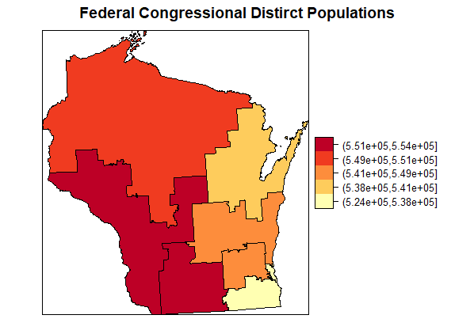

```{r setup, include=FALSE}
knitr::opts_chunk$set(echo = FALSE)
library(knitr)
library(png)
```

## Project Background
- Another Gerrymandering project with Brian Remlinger from Princeton
- Interested in understanding demography of political districts
- Focus on three district levels: Congress(Federal), State Upper House Legislatures, State Lower House Legislatures
- Focus on voting population (18 and Older)
- Packages used include: `sp`, `rgeos`, `raster`, `rgdal`, `tigris`, `tidycensus`


## Project Data: Tigris Package


```{r out.width= "50%", out.height= "50%", fig.align='center'}

```

## Project Data: TidyCensus Package

```{r pressure}

```


## Methods: Intersection & Area
- `intersect` census tracts with districts 
- `gArea` to find how much area of each tract is contained in each district
- Multiply population data by ratio of how much area of each tract is contained in each district by original tract area 
- Wrap it all in an `sapply` for iteration to create a data frame
- Some funky code to make everything not factors
- `merge` dataframe onto district polygons


## Example Code
```{r echo = TRUE, eval = FALSE}
sld_pop_table <- as.data.frame(t(sapply(1:length(state_lower@data$SLDLST), function(z) {
  sd_c_int <- intersect(x =  state_lower[state_lower@data$SLDLST == z,],
                         y = state_tracts_pop)
  dc_area <- gArea(spgeom = sd_c_int, byid = TRUE)/1000000
  percentage <- dc_area/sd_c_int@data$AREA
  Pop_Total <- round(sum(sd_c_int@data$Pop_Total*percentage))
  Pop_White <- round(sum(sd_c_int@data$Pop_White*percentage))
  Pop_Black <- round(sum(sd_c_int@data$Pop_Black*percentage))
  Pop_American_Indian <- round(sum(sd_c_int@data$Pop_American_Indian*percentage))
  Pop_Asian <- round(sum(sd_c_int@data$Pop_Asian*percentage))
  Pop_Hawaian_Pacific_Islander <- round(sum(sd_c_int@data$Pop_Hawaian_Pacific_Islander*percentage))
  Pop_Hispanic <- round(sum(sd_c_int@data$Pop_Hispanic*percentage))
  unlist(data.frame(state_lower[state_lower@data$SLDLST == z,], Pop_Total, Pop_White, Pop_Black,
             Pop_American_Indian, Pop_Asian, Pop_Hawaian_Pacific_Islander,
             Pop_Hispanic))

})))
# converting factors in  data.frame to numeric
sld_pop_table[] <- lapply(sld_pop_table, function(x)
  as.numeric(levels(x))[x])

# merging with  state lower districts
sld_pop <- merge(x = state_lower, y = sld_pop_table, by = "SLDLST")
```

## Results: SpatialPolygon Data Frames
- Output is three `SpatialPolygonDataFrames`, one for each district type with associated demographic data (18 years and older)

```{r out.width= "100%", out.height= "50%"}
include_graphics("fig/Example_Output_Table.png")
```


## Results: Wisconsin Maps
- Used `spplot` function in `sp` package along with packages `RColorBrewer` and `Classint`

```{r out.width= "30%", out.height= "40%"}
include_graphics("fig/WISLD_choro.png")
include_graphics("fig/WISUD_choro.png")

```
```{r out.width= "30%", out.height= "40%"}


```

## Results: North Carolina Maps
```{r out.width= "30%", out.height= "50%"}


```

```{r out.width= "30%", out.height= "50%"}


```

## Areas for Improvement
- Prisons & Military Base populations and locations
- Coordinate systems based on states or using `sf` package
- Voting Population and citizenship
- Using different methods for displaying choropleth maps (`ggplot2`, `GISTools`, `leaflet`, or  `tmap`)


## Conclusion
- Now a package for voting population demography by political district
- Allows a user to better understand how gerrymandering divides certain populations
- Another small step in the battle to fight the man
