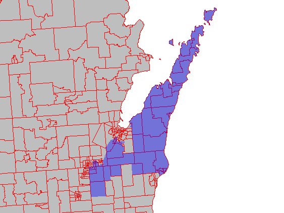

```{r setup, include=FALSE}
knitr::opts_chunk$set(echo = FALSE)
```

## Project Background


## More Project Background

- Bullet 1
- Bullet 2
- Bullet 3

## Project Data: Tigris Package


```{r echo = TRUE}

```

## Project Data: TidyCensus Package

```{r pressure}

```


## Methods: Intersection & Area
- `intersect` census tracts with districts
- `gArea` to find how much area of each tract is contained in each district
- Multiply population data by ratio of how much area of each tract is contained in each district by original tract area
- Wrap it all in an `sapply` for iteration to create a data frame
- Some funky code to make everything not factors
- `merge` dataframe onto district polygons




```{r}

```

## Example Code
```{r echo = TRUE, eval = FALSE}
sld_pop_table <- as.data.frame(t(sapply(1:length(state_lower@data$SLDLST), function(z) {
  sd_c_int <- intersect(x =  state_lower[state_lower@data$SLDLST == z,],
                         y = state_tracts_pop)
  dc_area <- gArea(spgeom = sd_c_int, byid = TRUE)/1000000
  percentage <- dc_area/sd_c_int@data$AREA
  Pop_Total <- round(sum(sd_c_int@data$Pop_Total*percentage))
  Pop_White <- round(sum(sd_c_int@data$Pop_White*percentage))
  Pop_Black <- round(sum(sd_c_int@data$Pop_Black*percentage))
  Pop_American_Indian <- round(sum(sd_c_int@data$Pop_American_Indian*percentage))
  Pop_Asian <- round(sum(sd_c_int@data$Pop_Asian*percentage))
  Pop_Hawaian_Pacific_Islander <- round(sum(sd_c_int@data$Pop_Hawaian_Pacific_Islander*percentage))
  Pop_Hispanic <- round(sum(sd_c_int@data$Pop_Hispanic*percentage))
  unlist(data.frame(state_lower[state_lower@data$SLDLST == z,], Pop_Total, Pop_White, Pop_Black,
             Pop_American_Indian, Pop_Asian, Pop_Hawaian_Pacific_Islander,
             Pop_Hispanic))

})))
# converting factors in  data.frame to numeric
sld_pop_table[] <- lapply(sld_pop_table, function(x)
  as.numeric(levels(x))[x])

# merging with  state lower districts
sld_pop <- merge(x = state_lower, y = sld_pop_table, by = "SLDLST")
```

## Results: Wisconsin

## Results: North Carolina

## Results: Choropleth Maps

## Areas for Improvement
-Prisons & Military Bases
-Voting Popupulation and Ciitzenship
-Coordinate systems wth 'sf' package

## Conclusion Slide
