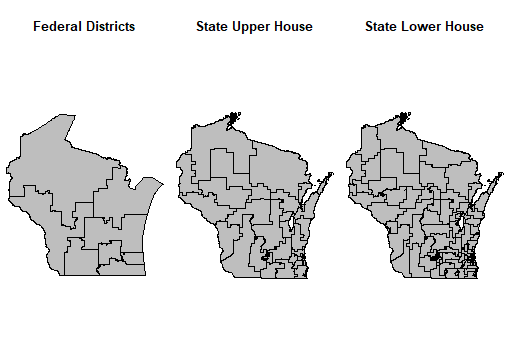

## 4.1 Summary (Andrea Huerfano)
The objective of this project is to use 2010 census tract level demographic data in conjunction with federal, state upper house, and state lower house precincts boundaries to better understand the demographic makeup of each of these political areas. This will be used to assist in better understanding the relationship between gerrymandering and demography in the US.  We will initially perform this analysis on the US state of Wisconsin to test out the process, and then perform it on another state (most likely North Carolina).  The demographic data we are interested in examining are total population and ethnic composition, but we may also examine age, income, and other interesting demographic aspects. After we have conducted the analysis on these two states, and created summary statistics and maps that allow users to better understand the demographic makeup of political districts in each state, we will outline how the process was done and how it can be applied to other states.  One of the largest challenges within this project is the collection of state legislative district boundaries and spatial data. There is no current complete database of state legislative districts, and therefore data is organized in different manners based on the platform that the individual state uses to distribute such data. Therefore, it will be a challenge to make a “one-size” fits all package mainly due to the uploading, cleaning, and organizing process.

## 4.2 Approach and Method (Cory Hertog)

### 4.2.1 Data 
Our data will mainly consist of US census tract spatial polygon data in the form of an ESRI shapefile with associate demographic data collected from the [census website](https://www.census.gov/geo/maps-data/data/tiger-data.html).  We will then use congressional district, state upper house district, and state lower house district boundary spatial data. The 115th  congressional districts (current congress) can be retrieved in the form of an ESRI Shapefile from the [US census website](https://www.census.gov/geo/reference/ansi_statetables.html). This state legislative bodies boundaries, both upper and lower house, will need to be retrieved from each states individual GIS or political boundary website and may come in numerous forms.  For Wisconsin, the first state we will focus on, the boundaries for both the upper and lower house voting districts can be retrieved in the form of ESRI shapefiles from the [Wisconsin GIS open source data website](http://data-ltsb.opendata.arcgis.com/).  All other states will most likely have state legislative district boundaries in the form of an ESRI shapefile, but there may be some variation. We will be using packages such as `sp`, `rgdal`, `rgeos`, and possibly `raster` to prepare and analyze the information and prepare mot of it. We may use statistical display packages like `ggmap` or `ggplot2` to display the findings in meaningful ways.

### 4.2.2 Code
- Load census tract Shapefiles and join with census tract demographic data (Andrea Huerfano)
- Load congressional, state upper, and state lower district boundaries (Cory Hertog)
- Find census tracts that intersect legislative boundaries (Andrea Huerfano)
  -Use disaggregate to split census blocks according to legislative boundaries. 
  -calculate whether immate population is being included in legislative districs.
- Calculate area of individual census tracts that are contained within individual legislative districts. Use these to create area ratios for individual census tracts that are partially intersected by legislative districts to calculate proportion of demographic data to be dispersed amongst individual legislative boundaries (Cory Hertog)
  - Create maps of legislative boundaries and associated demographic data of interest in wisconsin (Andrea Huerfano)
- Create maps of legislative boundaries and associated demographic data of interest in a second state (Cory Hertog)

### 4.2.3  Timelines
- 11/27/2017 - Have Wisconsin legislative and census tract polygons intersected
- 11/29/2017 - Create area ratios and demographic statistics for legislative districts
- 12/4/2017 - Finish demographic data displays of Wisconsin political districts, begin work on second state
- 12/8/2017 - Finish data displays of second state
- 12/11/2017 - Class presentation
- 12/13/2017 - Create general outline of how to proceed at a national scale for this project
- 12/15/2017 - Submit final package and report

## 4.3 Anticipated Outcomes (Andrea Huerfano)
- Create a  systematic process in R for combining census demographic data and current legislative districts for Wisconsin and a second state
    -
- Create maps and data displays of interesting data trends found within this information
- Create a fairly systematic description of how to use this package to analyze similar demographic data in other US states

